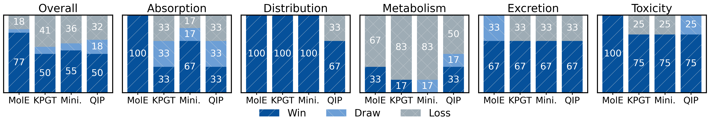

# ADMET Property Prediction Benchmark




This repository contains code to reproduce the TDC ADMET property prediction experiments. We train lightweight MLP heads on precomputed Boltz representations for each dataset, using five different random seeds.


## Running an experiment
```bash
python main.py --config configs/Ames/probing_boltz.yaml 
```

Results are stored under `results/<dataset_name>/`.

## Configs
- YAML files in `configs/<dataset_name>/` define dataset, task (e.g., `classification`), metric (e.g., `auroc`), data path, and core hyperparameters (`lr`, `hidden`, `layers`, `epochs`). 
- Supported `dataset_name`:
  - `Ames`, `BBB`, `Bioavailability`, `Caco2`, `DILI`, `HIA`, `Half`, `LD50`, `Lipophilicity`, `PPBR`, `Pgp`, `Solubility`, `VDss`, `hERG`, `CYP2C9_Substrate_CarbonMangels`, `CYP2C9_Veith`, `CYP2D6_Substrate_CarbonMangels`, `CYP2D6_Veith`, `CYP3A4_Substrate_CarbonMangels`, `CYP3A4_Veith`, `Clearance_Hepatocyte`, `Clearance_Microsome`

## Data
- We store datasets under `datasets/boltz_rep/<dataset_name>_{train,test}.npz`.
- Pre-extracted representations are stored as `.npz` like `Ames_train.npz` and `Ames_test.npz`, each containing `x` (features) and `y` (labels).
- To rebuild representation datasets, you can follow `construct_dataset/README.md`.
