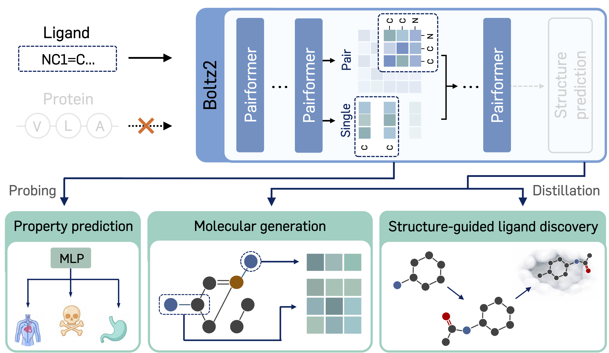

# Boltz is a Strong Baseline for Atom-Level Representation Learning

*Abstract.* Foundation models in molecular learning have advanced along two parallel tracks: protein models, which typically utilize evolutionary information to learn amino acid-level representations for folding, and small-molecule models, which focus on learning atom-level representations for property prediction tasks such as ADMET. Notably, cutting-edge protein-centric models such as Boltz now operate at atom-level granularity for protein-ligand co-folding, yet their atom-level expressiveness for small-molecule tasks remains unexplored. A key open question is whether these protein co-folding models capture transferable chemical physics or rely on protein evolutionary signals, which would limit their utility for small-molecule tasks. In this work, we investigate the quality of Boltz atom-level representations across diverse small-molecule benchmarks. Our results show that Boltz is competitive with specialized baselines on ADMET property prediction tasks and effective for molecular generation and optimization. These findings suggest that the representational capacity of cutting-edge protein-centric models has been underexplored and position Boltz as a strong baseline for atom-level representation learning for small molecules.

## Repository Layout

The code is currently being organized.

- `ADMET/`: TDC ADMET property prediction with lightweight MLP heads on frozen Boltz2 representations.
- `MOLGEN/`: Molecular generation on ZINC250k leveraging Boltz2 representations.
- `MOLOPT/`: Structure-guided ligand discovery (in-progress).

## Boltz2 modifications 

We use a modified version of the Boltz2 codebase released under the MIT License  
(https://github.com/jwohlwend/boltz). Modified version of Boltz2 is located in `_env/boltz_for_ADMET`.

- Boltz2 raises an error when the input protein sequence is empty.  
  Thus, we use a single `X` token as a dummy protein sequence input and modify the Pairformer trunk to ignore this token by slicing the corresponding indices.
- Boltz2 uses 3D conformations computed with the Universal Force Field (UFF) as implemented in RDKit. For molecules whose 3D conformations cannot be initialized, we instead initialize atomic coordinates by sampling uniformly from `[-1, 1]`.

## Cite

